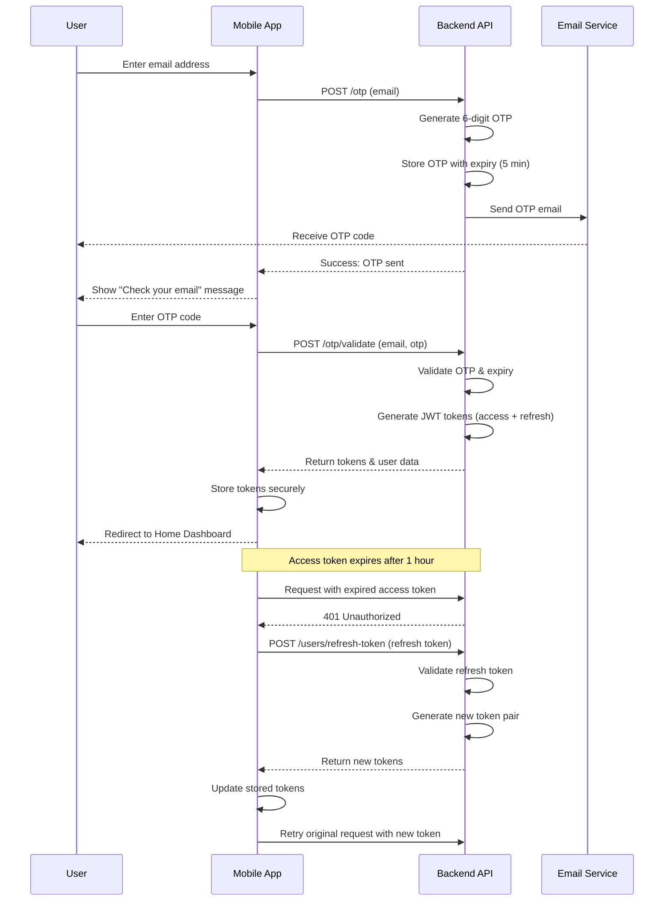
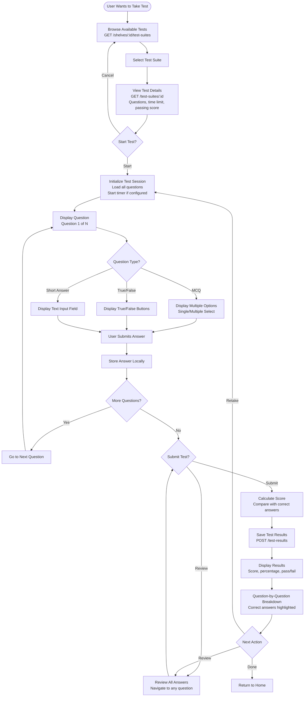
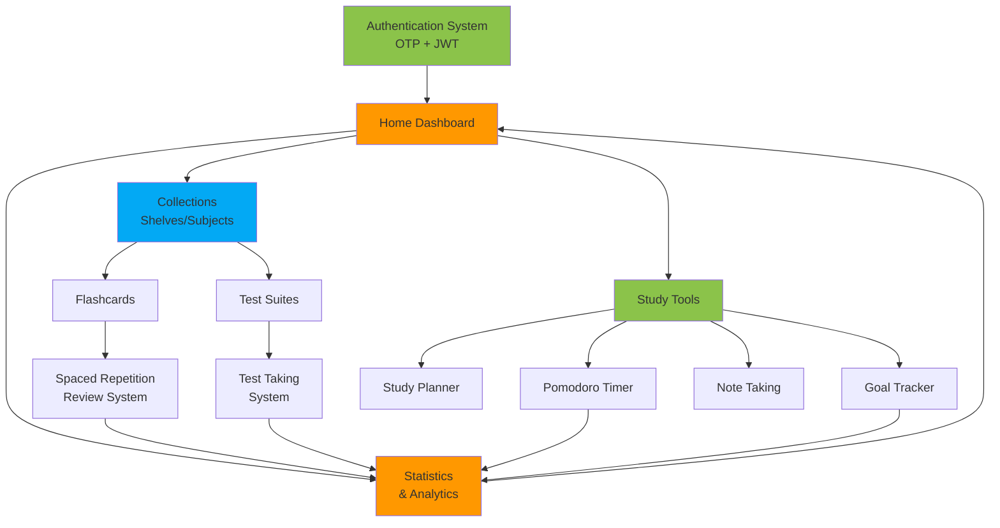

# Oopsly - End-to-End Flow Diagrams

This document contains comprehensive flow diagrams for all major features in the Oopsly application, visualizing the complete user journey from start to finish.

## Table of Contents

- [Authentication Flow](#authentication-flow)
- [Flashcard Creation & Review Flow](#flashcard-creation--review-flow)
- [Test Generation Flow](#test-generation-flow)
- [Test Taking Flow](#test-taking-flow)
- [Study Planning Flow](#study-planning-flow)
- [Pomodoro Study Session Flow](#pomodoro-study-session-flow)
- [Goal Tracking Flow](#goal-tracking-flow)
- [Collection Management Flow](#collection-management-flow)

---

## Authentication Flow

This diagram shows the complete OTP-based authentication process.



**User Journey:**

1. User lands on authentication screen
2. User enters email address
3. User receives OTP via email
4. User enters OTP code
5. User is authenticated and redirected to home

---

## Flashcard Creation & Review Flow

This diagram shows the complete process of creating flashcards and reviewing them with spaced repetition.

```mermaid
flowchart TD
    Start([User Opens App]) --> CheckAuth{Authenticated?}
    CheckAuth -->|No| Auth[Authentication Flow]
    Auth --> Home
    CheckAuth -->|Yes| Home[Home Dashboard]
    
    Home --> SelectAction{Choose Action}
    
    SelectAction -->|Create Cards| CreateFlow[Start Card Creation]
    SelectAction -->|Review Cards| ReviewFlow[Start Card Review]
    
    CreateFlow --> SelectShelve[Select or Create Shelve]
    SelectShelve --> SelectSubject[Select or Create Subject]
    SelectSubject --> InputCard[Input Card Front & Back]
    InputCard --> SetDifficulty[Set Initial Difficulty]
    SetDifficulty --> SaveCard[POST /shelves/:id/subjects/:id/cards]
    SaveCard --> MoreCards{Create More?}
    MoreCards -->|Yes| InputCard
    MoreCards -->|No| Home
    
    ReviewFlow --> GetDueCards[GET /shelves/:id/subjects/:id/cards<br/>Filter: Due for review]
    GetDueCards --> HasCards{Cards Available?}
    HasCards -->|No| NoCards[Show "All caught up!" message]
    NoCards --> Home
    HasCards -->|Yes| ShowCard[Display Card Front]
    ShowCard --> UserFlip[User taps to flip]
    UserFlip --> ShowAnswer[Display Card Back]
    ShowAnswer --> UserRate[User swipes to rate difficulty<br/>← Hard | Easy →]
    UserRate --> UpdateCard[PUT /cards/:id/difficulty<br/>Calculate next review date]
    UpdateCard --> MoreInQueue{More Cards?}
    MoreInQueue -->|Yes| ShowCard
    MoreInQueue -->|No| ShowSummary[Show Review Summary<br/>Time, cards reviewed, streak]
    ShowSummary --> UpdateStats[Update Statistics]
    UpdateStats --> Home
```

**User Journey:**

1. User navigates to flashcard section
2. User creates or selects a subject/collection
3. User creates flashcards with front/back content
4. System schedules cards for review based on spaced repetition
5. User reviews due cards by rating difficulty
6. System calculates next review dates
7. User sees progress and statistics

---

## Test Generation Flow

This diagram shows the three methods of test generation: manual, topic-based (AI), and document upload (AI).

```mermaid
flowchart TD
    Start([User Wants to Create Test]) --> Home[Home Dashboard]
    Home --> SelectMethod{Choose Creation Method}
    
    SelectMethod -->|Manual| ManualFlow[Manual Test Creation]
    SelectMethod -->|Topic| TopicFlow[AI Topic Generation]
    SelectMethod -->|Document| DocFlow[AI Document Upload]
    
    %% Manual Flow
    ManualFlow --> SelectShelve1[Select Shelve]
    SelectShelve1 --> CreateTest1[POST /shelves/:id/test-suites<br/>Create test suite]
    CreateTest1 --> AddQuestion[Add Question Manually]
    AddQuestion --> InputQuestion[Input: Question text, type, options]
    InputQuestion --> SaveQuestion[POST /test-suites/:id/questions]
    SaveQuestion --> MoreQuestions{Add More?}
    MoreQuestions -->|Yes| AddQuestion
    MoreQuestions -->|No| TestReady
    
    %% Topic-based AI Flow (In Development)
    TopicFlow --> InputTopic[Input Topic/Subject]
    InputTopic --> SetParams[Set Parameters<br/>Count: 1-50<br/>Difficulty: Easy/Med/Hard<br/>Types: MCQ/TF/SA]
    SetParams --> ShowProgress[Show "Generating..." progress]
    ShowProgress --> CallAI[AI Service Generates Questions<br/>Status: In Development]
    CallAI --> ReviewGenerated[Review Generated Questions]
    ReviewGenerated --> EditIfNeeded[Edit/Remove Questions]
    EditIfNeeded --> SaveAll[Batch Save Questions]
    SaveAll --> TestReady
    
    %% Document Upload Flow (In Development)
    DocFlow --> UploadDoc[Upload Document<br/>PDF, Image, etc.]
    UploadDoc --> ParseDoc[Parse Document Content<br/>Status: In Development]
    ParseDoc --> ExtractTopics[AI Extracts Key Topics]
    ExtractTopics --> ShowProgress
    
    TestReady[Test Suite Ready] --> TestDetails[View Test Details<br/>Question count, difficulty]
    TestDetails --> Options{Next Action}
    Options -->|Take Test| TakeTest[Go to Test Taking]
    Options -->|Edit| AddQuestion
    Options -->|Done| Home
```

**User Journey - Manual Creation:**

1. User selects "Create Test Manually"
2. User creates a test suite
3. User adds questions one by one
4. User saves test and can take it or share it

**User Journey - AI Generation (In Development):**

1. User selects "Generate from Topic"
2. User enters topic and parameters
3. AI generates relevant questions
4. User reviews and edits generated questions
5. User saves test suite

---

## Test Taking Flow

This diagram shows the complete test-taking experience from start to results.



**User Journey:**

1. User browses available test suites
2. User selects a test to take
3. User reviews test details (question count, time limit)
4. User starts test and answers questions
5. User can navigate between questions
6. User submits test
7. System calculates score
8. User views results with detailed breakdown
9. User can retake or return to home

---

## Study Planning Flow

This diagram shows how users plan and schedule their study sessions.

```mermaid
flowchart TD
    Start([User Opens Study Planner]) --> ViewCalendar[Display Weekly Calendar View<br/>Current week's schedule]
    ViewCalendar --> CheckSchedule{Has Scheduled Items?}
    CheckSchedule -->|Yes| DisplayEvents[Show Color-Coded Events<br/>Lectures, Study, Exams]
    CheckSchedule -->|No| EmptyState[Show "No events scheduled"]
    
    DisplayEvents --> UserAction
    EmptyState --> UserAction{User Action}
    
    UserAction -->|Add Event| SelectType[Select Event Type<br/>Lecture/Self-Study/Exam/Break]
    UserAction -->|Edit Event| SelectEvent[Select Existing Event]
    UserAction -->|View Day| DayDetails[View Single Day Schedule]
    UserAction -->|Done| Home
    
    SelectType --> TimeBlock[Drag to Create Time Block<br/>Set start & end time]
    TimeBlock --> AddDetails[Add Details<br/>Title, description, location]
    AddDetails --> LinkContent[Optional: Link to Shelve/Subject]
    LinkContent --> SetReminder[Set Reminder<br/>15min/1hr/1day before]
    SetReminder --> SaveEvent[Save Event<br/>POST /study-plan/events]
    SaveEvent --> SyncCalendar{Sync with External?}
    SyncCalendar -->|Yes| SyncGoogle[Sync with Google/Apple Calendar]
    SyncCalendar -->|No| ViewCalendar
    SyncGoogle --> ViewCalendar
    
    SelectEvent --> EditDetails[Edit Event Details]
    EditDetails --> UpdateEvent[Update Event<br/>PUT /study-plan/events/:id]
    UpdateEvent --> ViewCalendar
    
    DayDetails --> TaskList[View Tasks for Day]
    TaskList --> CheckTasks{Complete Tasks?}
    CheckTasks -->|Yes| MarkComplete[Mark Task Complete]
    CheckTasks -->|No| ViewCalendar
    MarkComplete --> UpdateStats[Update Daily Progress]
    UpdateStats --> ViewCalendar
```

**User Journey:**

1. User opens study planner
2. User views weekly calendar
3. User creates time blocks for study sessions
4. User adds details and links to subjects
5. User sets reminders
6. User can sync with external calendars
7. User tracks daily progress

---

## Pomodoro Study Session Flow

This diagram shows the focused study session using the Pomodoro technique.

```mermaid
flowchart TD
    Start([User Starts Pomodoro]) --> SelectMode[Select Study Mode<br/>Flashcards/Reading/Practice]
    SelectMode --> SelectContent[Select Content<br/>Subject or Test Suite]
    SelectContent --> ConfigPomodoro[Configure Pomodoro<br/>Focus: 25min<br/>Short Break: 5min<br/>Long Break: 15min<br/>Sessions before long break: 4]
    ConfigPomodoro --> OptionalBG[Optional: Select Background Sound<br/>White Noise/Rain/Lo-fi/Silent]
    OptionalBG --> StartSession[Start Focus Session]
    
    StartSession --> FocusMode[Enter Focus Mode<br/>Minimize distractions<br/>Display countdown timer<br/>Lock navigation optional]
    FocusMode --> StudyContent[Display Study Content<br/>Based on selected mode]
    StudyContent --> TimerRunning{Timer Active?}
    
    TimerRunning -->|Counting Down| CheckComplete{25min Complete?}
    CheckComplete -->|No| AllowPause{User Pauses?}
    AllowPause -->|No| TimerRunning
    AllowPause -->|Yes| PauseState[Paused State<br/>Allow resume or quit]
    PauseState --> ResumeQuit{Resume or Quit?}
    ResumeQuit -->|Resume| TimerRunning
    ResumeQuit -->|Quit| EndEarly[End Session Early<br/>Record partial time]
    EndEarly --> SessionSummary
    
    CheckComplete -->|Yes| PlaySound[Play Completion Sound<br/>Haptic feedback]
    PlaySound --> IncrementCount[Increment Session Count]
    IncrementCount --> RecordTime[Record Focus Time<br/>Save to statistics]
    RecordTime --> CheckBreak{Need Long Break?}
    CheckBreak -->|Every 4 sessions| LongBreak[Long Break: 15 minutes<br/>Encourage user to rest]
    CheckBreak -->|Otherwise| ShortBreak[Short Break: 5 minutes<br/>Optional stretching tips]
    
    LongBreak --> BreakTimer[Display Break Timer]
    ShortBreak --> BreakTimer
    BreakTimer --> BreakEnd{Break Complete?}
    BreakEnd -->|Yes| ContinueStudy{Continue Studying?}
    BreakEnd -->|No| BreakTimer
    
    ContinueStudy -->|Yes| StartSession
    ContinueStudy -->|No| SessionSummary[Display Session Summary<br/>Total focus time<br/>Sessions completed<br/>Cards reviewed/Questions answered]
    
    SessionSummary --> RateSession[Rate Focus Level<br/>1-5 stars]
    RateSession --> SaveSession[Save Session Data<br/>POST /study-sessions]
    SaveSession --> UpdateStreak[Update Study Streak]
    UpdateStreak --> CheckAchievements[Check for Achievements<br/>"5 sessions in a row!"<br/>"100 total sessions!"]
    CheckAchievements --> ShowReward{Achievement Unlocked?}
    ShowReward -->|Yes| DisplayBadge[Display Badge/Reward]
    ShowReward -->|No| Home
    DisplayBadge --> Home[Return to Home]
```

**User Journey:**

1. User selects Pomodoro timer
2. User chooses study content
3. User configures timer settings
4. User starts 25-minute focus session
5. User studies with minimal distractions
6. Timer completes, user takes 5-minute break
7. After 4 sessions, user takes 15-minute long break
8. User reviews session summary and stats
9. System updates streaks and achievements

---

## Goal Tracking Flow

This diagram shows how users set, track, and achieve study goals.

```mermaid
flowchart TD
    Start([User Opens Goal Tracker]) --> ViewGoals[Display Goal Dashboard<br/>Active goals, progress bars]
    ViewGoals --> CheckGoals{Has Goals?}
    CheckGoals -->|No| EmptyState[Show "Set your first goal"<br/>Motivational message]
    CheckGoals -->|Yes| DisplayGoals[Display Goal Cards<br/>Progress, deadline, status]
    
    EmptyState --> CreateGoal
    DisplayGoals --> UserAction{User Action}
    
    UserAction -->|Create New| CreateGoal[Create New Goal]
    UserAction -->|View Details| SelectGoal[Select Goal Card]
    UserAction -->|Edit| EditGoal[Edit Existing Goal]
    UserAction -->|Complete| MarkComplete[Mark Goal Complete]
    UserAction -->|Done| Home
    
    CreateGoal --> GoalType[Select Goal Type<br/>Study Hours/Cards Reviewed/<br/>Tests Completed/Subject Mastery]
    GoalType --> SetTarget[Set Target<br/>Quantity & timeframe<br/>e.g., "Review 100 cards in 7 days"]
    SetTarget --> AddDetails[Add Details<br/>Title, description, priority]
    AddDetails --> LinkContent[Optional: Link to Specific<br/>Shelve or Subject]
    LinkContent --> SetDeadline[Set Deadline Date]
    SetDeadline --> SetReminders[Configure Reminders<br/>Daily/Weekly notifications]
    SetReminders --> SaveGoal[Save Goal<br/>POST /goals]
    SaveGoal --> ViewGoals
    
    SelectGoal --> GoalDetails[Display Goal Details<br/>Progress chart<br/>Daily breakdown<br/>Streak calendar]
    GoalDetails --> CheckProgress[View Progress History<br/>Days completed<br/>Completion rate]
    CheckProgress --> LogActivity{Manual Log?}
    LogActivity -->|Yes| LogEntry[Log Activity<br/>Update progress]
    LogActivity -->|No| GoalDetails
    LogEntry --> UpdateProgress[Update Progress Bar<br/>Recalculate completion %]
    UpdateProgress --> GoalDetails
    
    EditGoal --> ModifyDetails[Modify Target/Deadline]
    ModifyDetails --> UpdateGoal[Update Goal<br/>PUT /goals/:id]
    UpdateGoal --> ViewGoals
    
    MarkComplete --> ConfirmComplete{Achieved?}
    ConfirmComplete -->|Yes| Celebrate[Show Celebration Animation<br/>"Goal Achieved!" 🎉]
    ConfirmComplete -->|No| AbandonGoal[Mark as Abandoned<br/>Optional: Reason]
    Celebrate --> RecordAchievement[Record Achievement<br/>Save to history]
    AbandonGoal --> ArchiveGoal[Move to Archive]
    RecordAchievement --> UpdateStats[Update Overall Statistics<br/>Goals completed count<br/>Success rate]
    ArchiveGoal --> ViewGoals
    UpdateStats --> SuggestNext[Suggest Next Goal<br/>Based on patterns]
    SuggestNext --> ViewGoals
```

**User Journey:**

1. User opens goal tracker
2. User creates a new study goal with target
3. User sets deadline and reminders
4. User tracks progress daily
5. System sends reminder notifications
6. User views progress charts and streaks
7. User completes goal or updates it
8. System celebrates achievement
9. System suggests next goals

---

## Collection Management Flow

This diagram shows how users organize content into shelves, subjects, and share with others.

```mermaid
flowchart TD
    Start([User Opens Collections]) --> ViewShelves[Display All Shelves<br/>GET /shelves<br/>Grid/List view]
    ViewShelves --> UserAction{User Action}
    
    UserAction -->|Create Shelve| CreateShelve[Create New Shelve]
    UserAction -->|Select Shelve| SelectShelve[Select Shelve Card]
    UserAction -->|Search| SearchShelves[Search Shelves<br/>By name or tag]
    UserAction -->|Done| Home
    
    CreateShelve --> InputName[Input Shelve Details<br/>Name, description, icon, color]
    InputName --> SaveShelve[POST /shelves<br/>Create shelve]
    SaveShelve --> ViewShelves
    
    SelectShelve --> ShelveDetails[Display Shelve Details<br/>GET /shelves/:id<br/>Subjects, test suites, stats]
    ShelveDetails --> ShelveAction{User Action}
    
    ShelveAction -->|Add Subject| CreateSubject[Create New Subject]
    ShelveAction -->|Add Test| CreateTestSuite[Create Test Suite]
    ShelveAction -->|Share| ShareFlow[Share Shelve]
    ShelveAction -->|Edit| EditShelve[Edit Shelve Details]
    ShelveAction -->|Delete| DeleteShelve[Soft Delete Shelve<br/>PATCH /shelves/:id]
    ShelveAction -->|View Subject| SelectSubject[Select Subject]
    ShelveAction -->|Back| ViewShelves
    
    CreateSubject --> InputSubject[Input Subject Details<br/>Name, description]
    InputSubject --> SaveSubject[POST /shelves/:id/subjects]
    SaveSubject --> ShelveDetails
    
    CreateTestSuite --> TestCreation[Go to Test Generation Flow]
    TestCreation --> ShelveDetails
    
    ShareFlow --> ShareMethod{Share Method}
    ShareMethod -->|Public Link| GenerateLink[Generate Public Link<br/>Read-only access]
    ShareMethod -->|Invite Users| InviteUsers[Input User Emails<br/>Set permissions]
    GenerateLink --> CopyLink[Copy Link to Clipboard<br/>Show "Link copied!" message]
    InviteUsers --> SendInvites[Send Email Invitations<br/>POST /shelves/:id/share]
    CopyLink --> ShareConfirm[Share Confirmation]
    SendInvites --> ShareConfirm
    ShareConfirm --> ShelveDetails
    
    EditShelve --> UpdateDetails[Update Name/Description/Color]
    UpdateDetails --> UpdateShelve[PUT /shelves/:id]
    UpdateShelve --> ShelveDetails
    
    DeleteShelve --> ConfirmDelete{Confirm Delete?}
    ConfirmDelete -->|Cancel| ShelveDetails
    ConfirmDelete -->|Confirm| SoftDelete[Mark as Deleted<br/>Cascade to subjects & cards]
    SoftDelete --> ViewShelves
    
    SelectSubject --> SubjectDetails[Display Subject Details<br/>GET /subjects/:id<br/>Cards, statistics]
    SubjectDetails --> SubjectAction{User Action}
    SubjectAction -->|Add Cards| CreateCards[Go to Card Creation]
    SubjectAction -->|Review| ReviewCards[Go to Card Review Flow]
    SubjectAction -->|Edit| EditSubject[Edit Subject]
    SubjectAction -->|Delete| DeleteSubject[Delete Subject<br/>PATCH /subjects/:id]
    SubjectAction -->|Back| ShelveDetails
    
    CreateCards --> CardCreation[Card Creation Form]
    CardCreation --> SubjectDetails
    ReviewCards --> ReviewFlow[Card Review Flow]
    ReviewFlow --> SubjectDetails
    EditSubject --> UpdateSubject[Update Subject Details]
    UpdateSubject --> SubjectDetails
    DeleteSubject --> SubjectDetails
    
    SearchShelves --> SearchResults[Display Search Results<br/>Filtered shelves]
    SearchResults --> SelectResult{Select Result?}
    SelectResult -->|Yes| SelectShelve
    SelectResult -->|No| ViewShelves
```

**User Journey:**

1. User views all their shelves (collections)
2. User creates a new shelve
3. User adds subjects to organize content
4. User adds flashcards or test suites to subjects
5. User can share shelve with others via link or email
6. User can edit or delete shelves/subjects
7. System maintains hierarchical organization
8. User can search across all shelves

---

## System Integration Overview

This diagram shows how all features integrate together in the overall application flow.



---

## Notes on Implementation Status

- ✅ **Fully Implemented Flows**: Authentication, Flashcard Creation & Review, Manual Test Creation, Collection Management, Pomodoro Timer, Study Planning, Goal Tracking
- 🔄 **In Development**: AI-powered Test Generation (Topic-based and Document Upload)
- 📋 **Planned**: Advanced sharing features, Community marketplace, Calendar sync integration

---

**Last Updated:** 2026-01-31
