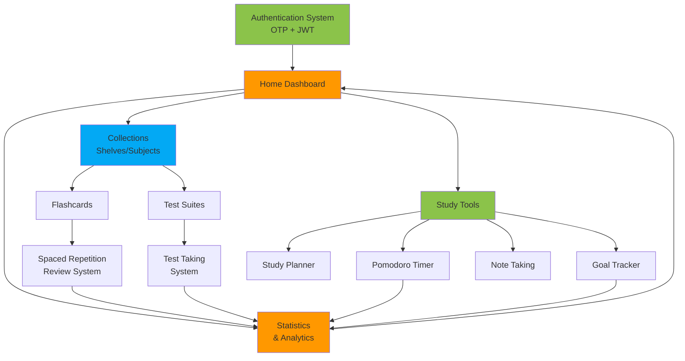

# Oopsly Flow Diagrams

This directory contains end-to-end flow diagrams for all major features in the Oopsly application. Each diagram visualizes the complete user journey from start to finish using Mermaid diagrams.

## Flow Documentation

### Core Application Flows

1. [Authentication Flow](./authentication-flow.md)
   - OTP-based authentication process
   - Token refresh mechanism
   - Session management

2. [Flashcard Creation & Review Flow](./flashcard-creation-review-flow.md)
   - Card creation process
   - Spaced repetition review cycle
   - Difficulty rating and scheduling

3. [Test Generation Flow](./test-generation-flow.md)
   - Manual test creation
   - AI topic-based generation (In Development)
   - AI document upload generation (In Development)

4. [Test Taking Flow](./test-taking-flow.md)
   - Test selection and execution
   - Question navigation
   - Results and analysis

5. [Study Planning Flow](./study-planning-flow.md)
   - Calendar-based planning
   - Event creation and scheduling
   - External calendar sync

6. [Pomodoro Study Session Flow](./pomodoro-study-session-flow.md)
   - Focus session management
   - Break intervals (short and long)
   - Achievement tracking

7. [Goal Tracking Flow](./goal-tracking-flow.md)
   - Goal creation and configuration
   - Progress tracking
   - Achievement celebrations

8. [Collection Management Flow](./collection-management-flow.md)
   - Hierarchical organization (Shelves → Subjects → Cards)
   - Sharing and collaboration
   - Search and navigation

## Implementation Status

- ✅ **Fully Implemented Flows**: Authentication, Flashcard Creation & Review, Manual Test Creation, Collection Management, Pomodoro Timer, Study Planning, Goal Tracking, Test Taking
- 🔄 **In Development**: AI-powered Test Generation (Topic-based and Document Upload)
- 📋 **Planned**: Advanced sharing features, Community marketplace, Calendar sync integration

## How to Read These Diagrams

### Sequence Diagrams

Sequence diagrams show interactions between components over time:

- **Participants**: User, UI (Mobile App), API (Backend), External Services
- **Arrows**: Messages/requests between participants
- **Notes**: Additional context or explanations

### Flow Diagrams

Flow diagrams show decision trees and process flows:

- **Rectangles**: Actions or processes
- **Diamonds**: Decision points
- **Arrows**: Flow direction
- **Rounded rectangles**: Start/end points

## Related Documentation

- [Features Documentation](../features/README.md) - Detailed feature specifications
- [API Documentation](../API.md) - Backend API specifications
- [Architecture](../ARCHITECTURE.md) - System architecture overview
- [Original Flow Diagrams](../FLOW_DIAGRAMS.md) - Consolidated flows reference

## System Integration Overview

All features integrate together in a cohesive application flow:

## Contributing

When adding new flow diagrams:

1. Use Mermaid syntax for diagrams
2. Include both diagram and user journey description
3. List key features covered in the flow
4. Ensure diagrams are clear and readable
5. Update this index when adding new flows

---

**Last Updated:** 2026-01-31
