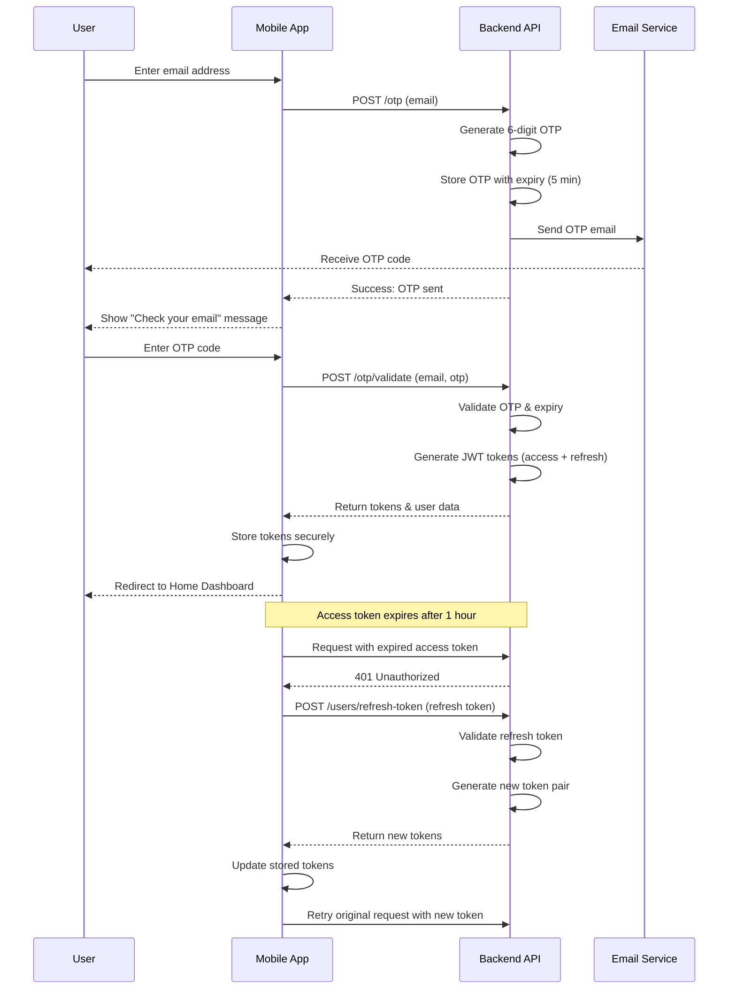

# Authentication Flow

This diagram shows the complete OTP-based authentication process.

## Sequence Diagram

## User Journey

1. User lands on authentication screen
2. User enters email address
3. User receives OTP via email
4. User enters OTP code
5. User is authenticated and redirected to home

## Key Features

- Email-based OTP system (6-digit code)
- OTP expiry after 5 minutes
- JWT access token (1 hour expiry)
- Refresh token mechanism for seamless session renewal
- Secure token storage
- Automatic token refresh on expiry
