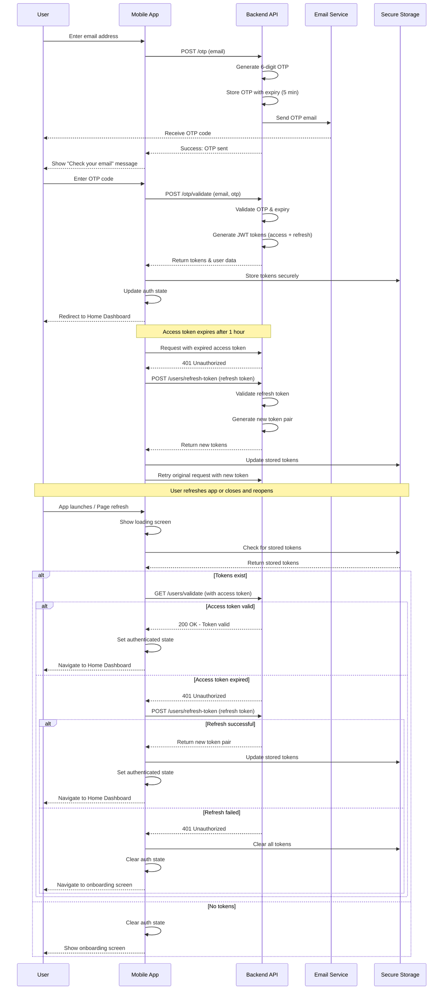

# Authentication Flow

This diagram shows the complete OTP-based authentication process with persistent authentication.

## Sequence Diagram

## User Journey

### Initial Authentication

1. User lands on authentication screen
2. User enters email address
3. User receives OTP via email
4. User enters OTP code
5. User is authenticated and redirected to home
6. Tokens are stored securely in device storage

### Persistent Authentication (Page Refresh / App Restart)

1. User refreshes page or reopens app
2. App shows loading screen while checking authentication
3. App retrieves stored tokens from secure storage
4. App validates access token with backend
5. If access token is valid:
   - User is immediately logged in
   - User sees home dashboard
6. If access token is expired but refresh token is valid:
   - App automatically refreshes tokens
   - User is logged in with new tokens
   - User sees home dashboard
7. If both tokens are invalid or missing:
   - Tokens are cleared from storage
   - User is redirected to onboarding

## Key Features

- Email-based OTP system (6-digit code)
- OTP expiry after 5 minutes
- JWT access token (1 hour expiry)
- Refresh token mechanism for seamless session renewal
- **Secure token storage using:**
  - AsyncStorage (React Native async-storage)
  - Uses secure native storage on iOS/Android
  - Uses localStorage on web platform
  - Cross-platform compatible solution
- **Automatic token refresh on expiry**
- **Persistent authentication across app restarts**
- **Token validation on app launch**
- **Loading state during authentication check**
- **Graceful error handling for expired tokens**

## Authentication States

1. **Loading**: Checking for stored credentials
2. **Unauthenticated**: No valid tokens, show onboarding
3. **Authenticated**: Valid tokens, user can access protected routes
4. **Token Refresh**: Automatically refreshing expired access token

## Security Considerations

- Tokens are stored using platform-specific secure storage
- Access tokens have short expiry (1 hour)
- Refresh tokens enable seamless re-authentication
- Failed refresh attempts clear all stored credentials
- Token validation happens on every app launch
- Network errors during validation are handled gracefully
