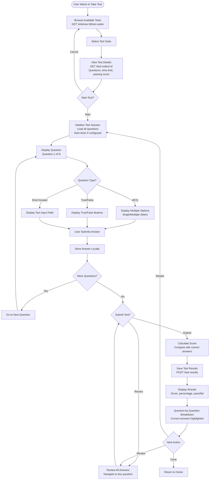

# Test Taking Flow

This diagram shows the complete test-taking experience from start to results.

## Flow Diagram

## User Journey

1. User browses available test suites
2. User selects a test to take
3. User reviews test details (question count, time limit)
4. User starts test and answers questions
5. User can navigate between questions
6. User submits test
7. System calculates score
8. User views results with detailed breakdown
9. User can retake or return to home

## Key Features

- Browse and select from available tests
- View test details before starting
- Support for multiple question types (MCQ, True/False, Short Answer)
- Question navigation (next, previous, jump to question)
- Answer review before submission
- Immediate score calculation
- Detailed results breakdown
- Retry capability
- Test history tracking
